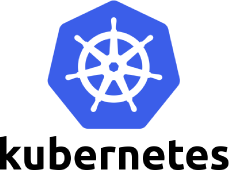
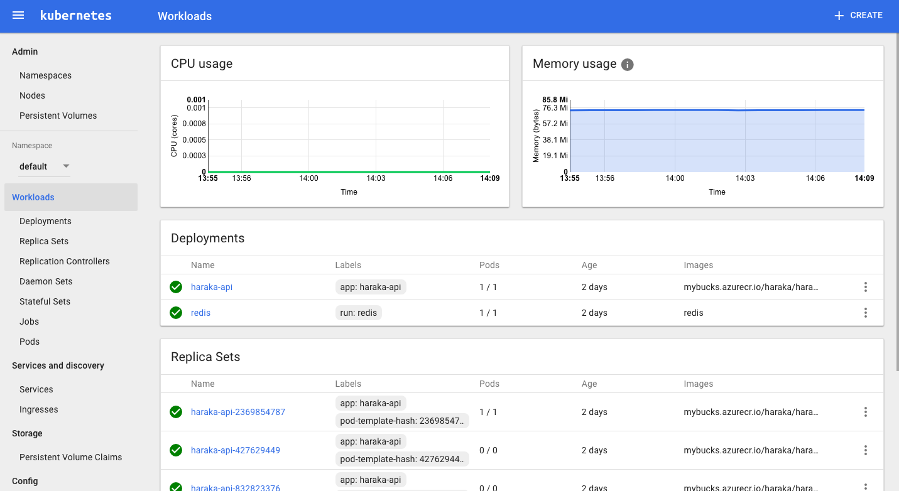

class: center, middle


# in


---

# About

1. What is Kubernetes and why use it?

2. Kubernetes concepts

3. Azure container registry

4. Creating an Azure cluster with Kubernetes

5. Creating a deployment

6. Creating a service

7. Creating a public service

8. Creating a config map

---
class: center, middle

# What is  and why use it?

---
layout: false
.left-column[
  ## What is it?

]
.right-column[
> Kubernetes is an open-source system for automating deployment, scaling, and management of containerized applications.

- Runs on top of distributed or local virtual machines or physical machines

- Groups all your containers into logical units

]
---
layout: false
.left-column[
  ## What is it?
  ## Why use it?

]
.right-column[
1. Horizontal scaling

2. Automated rollouts

3. Health monitoring

4. Automatic self-healing

5. Secret and configuration management

]

---
class: center, middle

#  concepts

---
layout: false
.left-column[
  ## Pod
]
.right-column[
> A Pod is the basic building block of Kubernetes–the smallest and simplest unit in the Kubernetes object model that you create or deploy. A Pod represents a running process on your cluster.

- Kubernetes Pods are mortal. They are born and when they die, they are not resurrected.


]

---
layout: false
.left-column[
  ## Pod
  ## Deployment
]
.right-column[
- The way you define your Pods or Replica Set (a replicated set of pods)

- Defined using yaml:

```yaml
apiVersion: extensions/v1beta1
kind: Deployment
metadata:
  name: weather-api
spec:
  #How many pods you want in your replica set
  replicas: 1
  template:
    metadata:
      labels:
        app: weather-api
    spec:
      containers:
        #You containers
        - name: weather-api
          image: mybucks.azurecr.io/weather/weather-api:latest
          ports:
          - containerPort: 3000
          env: #Define your environment variables:
            - name: NODE_ENV
              value: "production"
```

]

---
layout: false
.left-column[
  ## Pod
  ## Deployment
  ## Service
]
.right-column[
- Services **abstract** your set of pods.

- Allow pods to communicate (Never communicate between pods directly because they are volatile)

- Some policy to select your pods (Usually using a label selector). Also called a **micro service**

- Publishing services (like LoadBalancer) allow you to have an outward facing service.

```yaml
kind: Service
apiVersion: v1
metadata:
  name: weather-api
spec:
  selector:
    app: weather-api
  ports:
    - protocol: TCP
      port: 80
      targetPort: 3000
  type: LoadBalancer

```

]

---
layout: false
.left-column[
  ## Pod
  ## Deployment
  ## Service
  ## Master + Nodes
]
.right-column[
- Master maintains state then replicated

- Interfaced with through kubectl

- Usually run on 1 node (VM) in the cluster

- Nodes are the VMs that are in your cluster.

- You don't interface with nodes

]

---
class: center, middle

#  container registry

---

layout: false
.left-column[
  ## Azure container registry
]
.right-column[
- Simply a storage location for your Docker images

- Good to keep registry close to your actual servers so image pull latency is kept low

- Works with native docker CLI

- Uses ``` myregistry.azurecr.io/<folder>/<image>:latest ```

- Login in to Azure in the docker CLI:

``docker login myregistry.azurecr.io -u xxxxxxxx-xxxx-xxxx-xxxx-xxxxxxxxxxxx -p myPassword``

- You can now push/pull a tagged image!

``docker push myregistry.azurecr.io/weather/weather-api``

``docker push myregistry.azurecr.io/weather/weather``

]

---
class: center, middle

# Creating an Azure cluster with Kubernetes

---

layout: false
.left-column[
  ## Creating an Azure cluster with Kubernetes and connecting to it with kubectl
]
.right-column[

Using Azure CLI (available for PowerShell for Windows if you hate yourself)

You could also use the web interface if you hate yourself even more.

First login into azure in the CLI interface:
``az login``

Create a resource group on Azure:

``az group create --name=my-resource-group --location=westus``

Create a cluster on Azure:

``az acs create --orchestrator-type=kubernetes --resource-group my-resource-group --name=any-acs-cluster-name --dns-prefix=some-unique-name --generate-ssh-keys``

Get the credentials for your cluster into the ``kubectl`` tool:

``az acs kubernetes get-credentials --resource-group=my-resource-group --name=any-acs-cluster-name``

]

---

layout: false
.left-column[
  ## Creating an Azure cluster with Kubernetes and connecting to it with kubectl
  ## Check it all works!
]
.right-column[

Using kubectl you can proxy the web interface to your local machine using:

``kubectl proxy``

Now navigate to http://localhost:8001/ui in a browser, and you should see something like this:



]

---
class: center, middle

# Creating a deployment

---
layout: false
.left-column[
  ## Create a deployment
]
.right-column[

Create a file called ``tester-server-deployment.yml``

```yaml
apiVersion: extensions/v1beta1
kind: Deployment
metadata:
  name: tester-server
spec:
  replicas: 5
  template:
    metadata:
      labels:
        app: tester-server
    spec:
      containers:
        - name: tester-server
          image: mybucks.azurecr.io/test/tester-server:2
          ports:
          - containerPort: 50051
      imagePullSecrets:
        - name: regsecret #The credentials for the container registry
```

Creates 5 Pods of the tester-server image. Exposes port 50051 in each Pod.

Commit the deployment using:

``kubectl create -f tester-server-deployment.yml``

]
---

class: center, middle

# Creating a service

---
layout: false
.left-column[
  ## Create a service
]
.right-column[

Create a file called ``tester-server-service.yml``

```yaml
apiVersion: v1
metadata:
  name: tester-server
spec:
  selector:
    app: tester-server
  ports:
    - protocol: TCP
      port: 80
      targetPort: 50051
```

This will expose the server Pods to the rest of the cluster via port 80.

From any Pod in the cluster you can access this service by using its name "tester-server". So you can connect using http://tester-server:80

Commit the service using:

``kubectl create -f tester-server-service.yml``

]
---

class: center, middle

# Creating a public service

---
layout: false
.left-column[
  ## Create a deployment for the client facing service
]
.right-column[

Create a file called ``tester-client-deployment.yml``

```yaml
apiVersion: extensions/v1beta1
kind: Deployment
metadata:
  name: tester-client
spec:
  replicas: 1
  template:
    metadata:
      labels:
        app: tester-client
    spec:
      containers:
        - name: tester-server
          image: mybucks.azurecr.io/test/tester-client:latest
          ports:
          - containerPort: 8080
          env: #These will be passed as an environment variable
            - name: CLIENT_URL
              value: "tester-server:80" #Domain for other service
      imagePullSecrets:
        - name: regsecret
```

This is the same as the server deployment

``kubectl create -f tester-client-deployment.yml``

]

---
layout: false
.left-column[
  ## Create a deployment for the client facing service
  ## Expose it as a public service
]
.right-column[

Create a file called ``tester-client-service.yml``

```yaml
kind: Service
apiVersion: v1
metadata:
  name: tester-client-service
spec:
  selector:
    app: tester-client
  ports:
    - protocol: TCP
      port: 80
      targetPort: 8080
  type: LoadBalancer
```

This will create a user facing service using the default platform load balancer (Azure).

It will give you a public IP address so you can access the service from anywhere!

``kubectl create -f tester-client-service.yml``

]
---

class: center, middle

# Creating a secret

---
layout: false
.left-column[
  ## Create a secret
]
.right-column[

Create a file for the username and password respectively:

``echo -n "admin" > ./username.txt``

``echo -n "1f2d1e2e67df" > ./password.txt``

Then run:

``kubectl create secret generic db-user-pass --from-file=./username.txt --from-file=./password.txt``

You can now call the following to check it was created:

``kubectl get secret db-user-pass -o yaml``

]
---
layout: false
.left-column[
  ## Create a secret
  ## As a volume
]
.right-column[

You can use a secret in a Pod by either mapping it to an environment variable or a volume

As a volume in your deployment:

```yaml
  containers:
    - name: tester-server
      image: mybucks.azurecr.io/test/tester-client:latest
      ports:
      - containerPort: 8080
      env: #These will be passed as an environment variable
        - name: CLIENT_URL
          value: "tester-server:80" #Domain for other service
      volumeMounts:
        - name: db-user-pass
          mountPath: "/etc/db-config"
  volumes:
    - name: "db-user-pass"
      secret:
      - secretName: "db-user-pass"
  imagePullSecrets:
    - name: regsecret
```

You can now access the secret files in the Pod under /etc/db-config

]

---
layout: false
.left-column[
  ## Create a secret
  ## As a volume
  ## As an environment variable
]
.right-column[

As an environment variable

```yaml
  containers:
    - name: tester-server
      image: mybucks.azurecr.io/test/tester-client:latest
      ports:
      - containerPort: 8080
      env: #These will be passed as an environment variable
        - name: SECRET_USERNAME
          valueFrom:
            secretKeyRef:
              name: db-user-pass
              key: username
        - name: SECRET_PASSWORD
          valueFrom:
            secretKeyRef:
              name: db-user-pass
              key: password
```

You can now access the secrets using ``echo $SECRET_PASSWORD``

]

---

class: center, middle

# Creating a config-map

---
layout: false
.left-column[
  ## Creating a config map
]
.right-column[

``kubectl create configmap game-config --from-file=docs/user-guide/configmap/kubectl``

combines the contents of the docs/user-guide/configmap/kubectl/ directory

```test
ls docs/user-guide/configmap/kubectl/
game.properties
ui.properties
```

]

---
layout: false
.left-column[
  ## Creating a config map
  ## As a volume mount
]
.right-column[

Config maps are very similar to secrets but are not encrypted or hidden in the kubectl console:

```yaml
  containers:
    - name: tester-server
      image: mybucks.azurecr.io/test/tester-client:latest
      ports:
      - containerPort: 8080
      volumeMounts:
      - name: test-config
        mountPath: "/app/config"
  volumes:
    - name: "test-config"
      configMap:
        name: test-config
```

You can now access the config-map file in /app/config

]

---
layout: false
.left-column[
  ## Creating a config map
  ## As a volume mount
  ## As an environment variable
]
.right-column[

Here you can expose the config map as environment variables:

```yaml
apiVersion: v1
kind: Pod
metadata:
  name: tester-client
spec:
  containers:
  - name: tester-client
    image: mybucks.azurecr.io/test/tester-client:latest
  - envFrom:
    configMap: test-config
```

]
